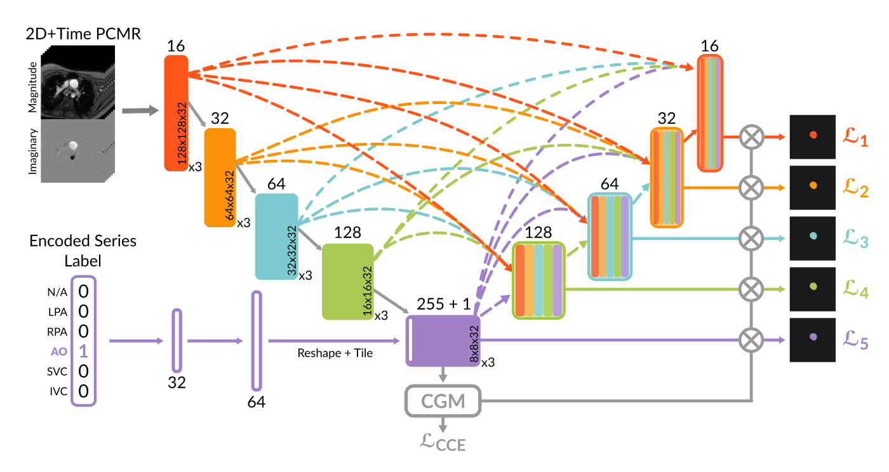

# MultiFlow: A unified deep learning framework for multi-vessel classification, segmentation and phenomapping of phase-contrast MRI validated on a multi-site single ventricle patient cohort 

This repository presents a deep learning pipeline for fully automated segmentation and downstream analysis of velocity-encoded phase-contrast magnetic resonance (PCMR) images. The primary application is within **Fontan circulation patients**, leveraging data from the **FORCE Registry**, but the methods are generalizable to other cardiovascular conditions.

**Tina Yao, Nicole St. Clair et al.** MultiFlow: A unified deep learning framework for multi-vessel classification, segmentation and clustering of phase-contrast MRI validated on a multi-site single ventricle patient cohort
 [[preprint]](https://arxiv.org/abs/2502.11993) [1]

## Motivation

Time-varying PCMR signals offer rich insights into cardiovascular physiology—beyond what static metrics like stroke volume can provide. However, large registries like **FORCE** (with >5,000 Fontan exams) primarily store raw PCMR data and reported metrics, with no time-resolved flow curves extracted.

Manual segmentation of these datasets is infeasible (>1,000 hours). **MultiFlowSeg** was designed to automate segmentation and extract time-varying flow curves across five key vessels:

- **Aorta (Ao)**
- **Left/Right Pulmonary Arteries (LPA/RPA)**
- **Superior/Inferior Vena Cava (SVC/IVC)**

These data are then analyzed using **Deep Temporal Clustering (DTC)** to uncover patient subtypes and their association with clinical outcomes (e.g., liver disease, transplant/mortality).

## Project Goals

1. **Develop a single DL model** capable of classifying and segmenting multiple vessel types from PCMR slices.
2. **Build a scalable, automated pipeline** for segmenting the entire FORCE registry.
3. **Extract time-varying flow curves** and perform unsupervised phenomapping using Deep Temporal Clustering (MultiFlowDTC).
4. **Correlate clusters with outcomes** like liver disease, and transplant/mortality.

## MultiFlowSeg Architecture

*Figure 1: Model architecture for multi-vessel segmentation and classification.*

## Segmentation & Derived Flow Curves

*Figure 2: Example of segmentation results and derived time-varying flow curves for key vessels.*

## MultiFlowDTC Architecture

*Figure 3: Model architecture for unsupervised clustering of flow curves.*

## Clusters and Phenomapping

*Figure 4: Clustered flow curves and associated phenomapping outcomes.*

